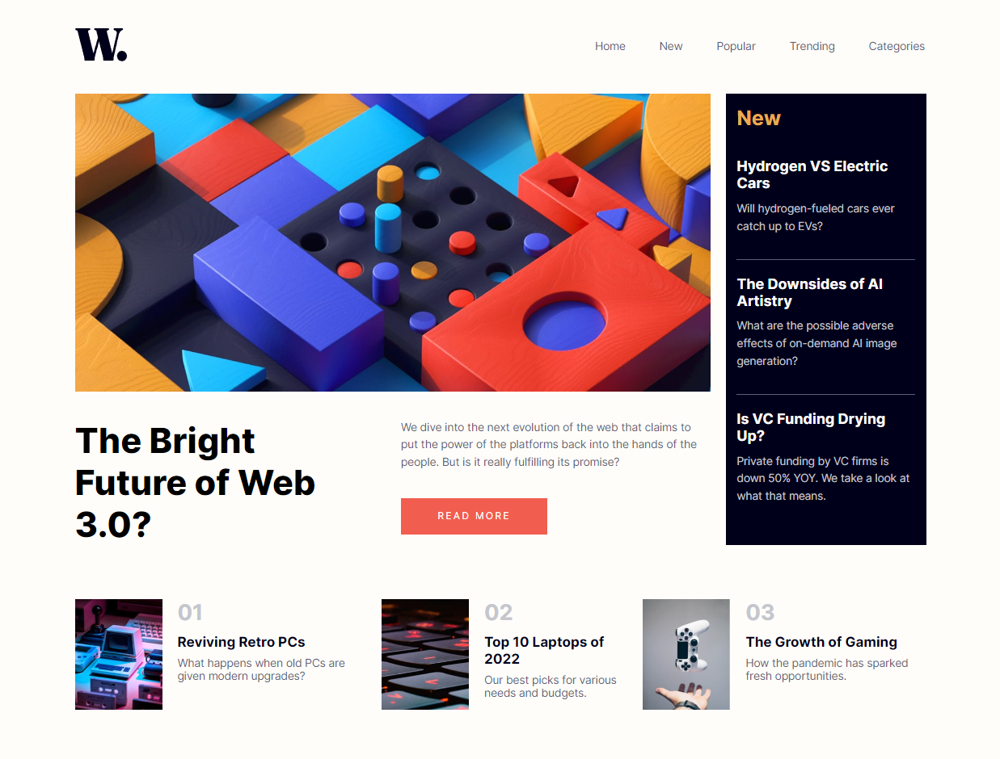

# Frontend Mentor - News homepage solution

This is a solution to the [News homepage challenge on Frontend Mentor](https://www.frontendmentor.io/challenges/news-homepage-H6SWTa1MFl). Frontend Mentor challenges help you improve your coding skills by building realistic projects. 

## Table of contents

- [Overview](#overview)
  - [Links](#links)
- [My process](#my-process)
  - [Built with](#built-with)
- [Author](#author)

## Overview

### Links

- Solution URL: [Solution URL](https://github.com/mackovv/News-homepage)
- Live Site URL: [Live Site URL](https://news-homepage-a.netlify.app/)

## My process

### Built with

- Semantic HTML5 markup
- Flexbox
- CSS Grid
- Mobile-first workflow
- BEM naming convention
- SCSS
- JavaScript

## Author

- Frontend Mentor - [@mackovv](https://www.frontendmentor.io/profile/mackovv)
